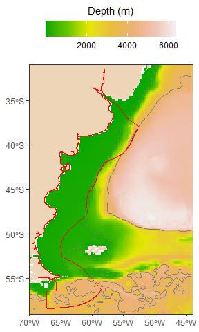
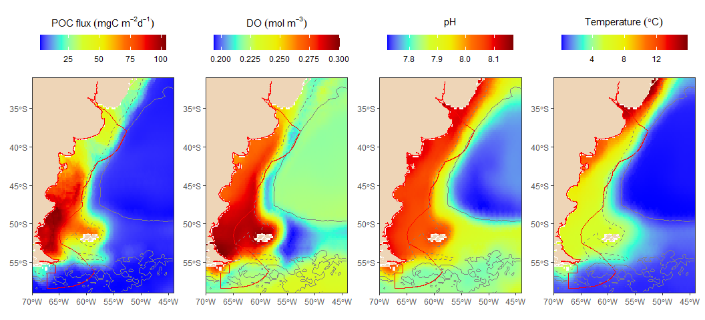
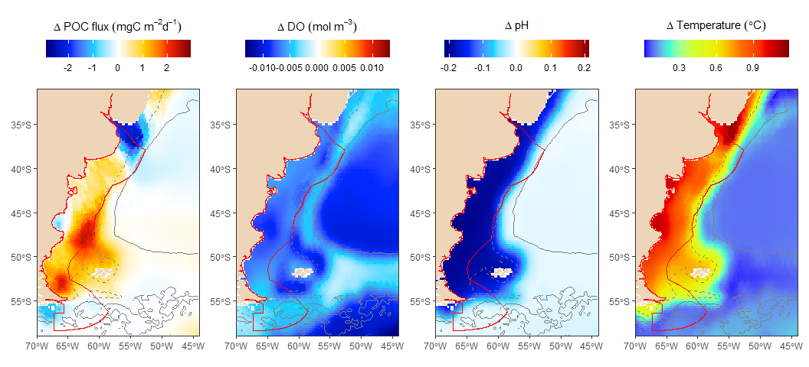
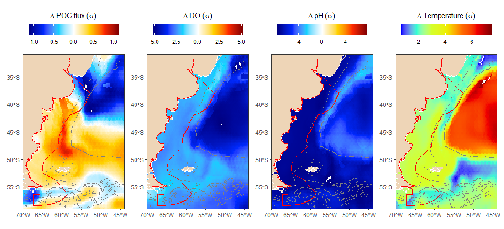
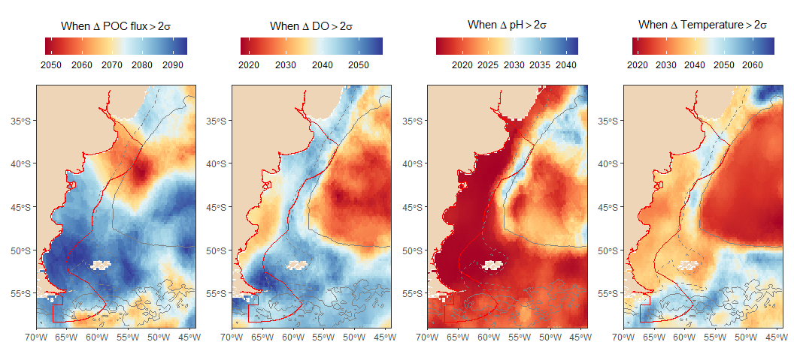
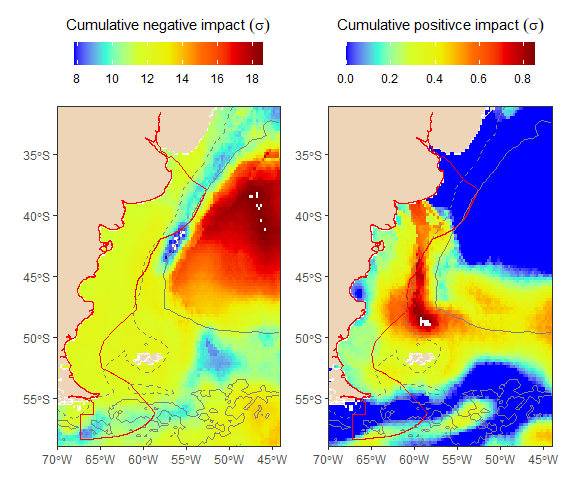
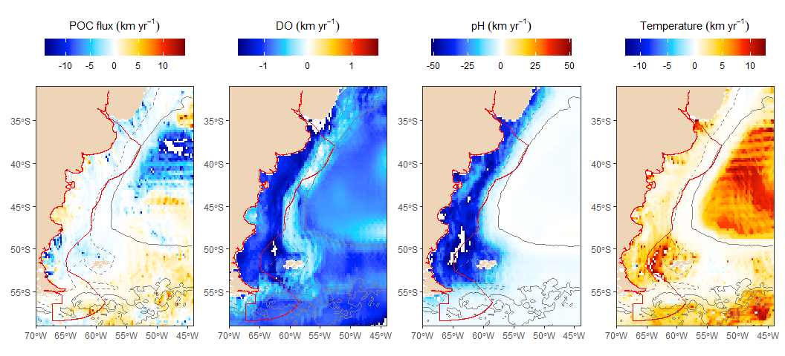
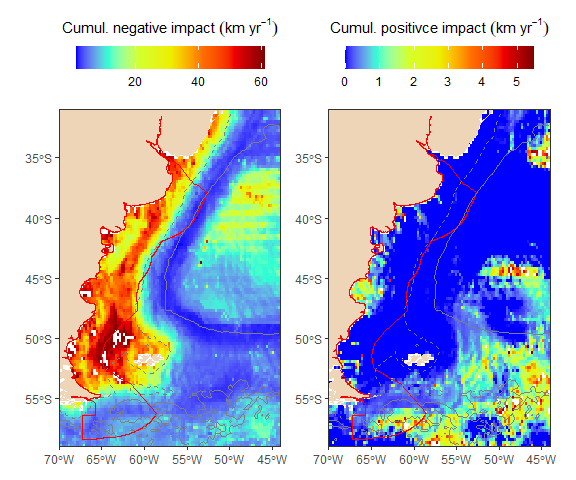

Display seafloor climate change data
================
Chih-Lin Wei
2024-07-30

# Sealfoor climate change dataset

This data package comprises ensemble model averages of CMIP6 historical
and future climate change projections for the seafloor within
Argentina’s Exclusive Economic Zone (EEZ). Yearly means were calculated
from five climate models: GFDL-ESM4, IPSL-CM6A-LR, MPI-ESM1-2-LR,
CNRM-ESM2-1, and NorESM2-MM, as part of the Coupled Models
Intercomparison Project Phase 6 (CMIP6). The ensemble averages were
computed from 1950 to 2000, 2041 to 2060, and 2081 to 2100. The export
flux of particulate organic carbon (POC) at the seafloor was derived
from export production at 100 meters depth (epc100) using the Martin
curve [(Martin et al.,
1987)](https://www.sciencedirect.com/science/article/pii/0198014987900860).
The equation for the export POC flux is given
by:$Flux = epc100*(depth/export\:depth)^{-0.858}$.

The depth information is based on the
[etopo2022](https://www.ncei.noaa.gov/products/etopo-global-relief-model)
dataset, and the export depth was fixed at 100 meters. Additionally, we
calculated the aragonite saturation state (aragsat) and calcite
saturation state (calcsat) as the ratio of carbonate concentration (co3)
to the carbonate concentration in equilibrium with aragonite (co3satarg)
and calcite (co3satcalc), respectively. It’s important to note that
co3satarg and aragsat were only available from the GFDL-ESM4 and
NorESM2-MM models. All CMIP6 data were downloaded from [Earth System
Grid Federation (ESGF)](https://esgf.llnl.gov/).

We can utilize this dataset to determine the occurrence and impact of
climate change hazards on deep-sea floors. As biological communities
adapt to long-term stability or variability in environmental conditions,
we can establish the historical variability (standard deviation between
1951-2000) as a reference point. Climate change can then be defined as
the disparity between future conditions and the historical average.
Climate change hazard, meanwhile, is the ratio of climate change to
historical variability. The time of emergence (ToE) of climate change is
identified as the point when future climate changes exceed twice the
historical variability. This approach allows us to standardize climate
change hazards across different variables, using their historical
variability as a standard unit. For instance, a specific variable’s
climate hazard could be 10 or 100 times its historical variability.

# Display the data using custom plot function

This vignette provides some simple examples to visualize the data
layers. First, we should load necessary R packages.

``` r
library(ArgentinaSSP585)
library(ggplot2)
library(dplyr)
library(patchwork)
library(tidyr)
library(RColorBrewer)
library(sf)
```

In this analysis, we want to display the ensemble average of historical
seafloor projections for export POC flux (epc), dissolved oxygen
concentration (o2), pH values (ph), and potential temperature (thetao)
from 1950 to 2000. Let’s break down the steps to construct the map:

1.  Data Preparation:

- We start by subsetting and converting the RasterBrick containing epc,
  o2, ph, and thetao into a data frame.
- Next, we stack the data frame using the
  [gather](https://tidyr.tidyverse.org/reference/gather.html) function
  and
  [group_split](https://dplyr.tidyverse.org/reference/group_split.html)
  the stacked data frame into a list based on epc, o2, ph, and thetao.

2.  Bathymetric Data and Argentina EEZ:

- The EEZ boundary (red polygon) is downloaded from
  [marineregions.org](https://marineregions.org/gazetteer.php?p=details&id=8466).
- The 200-m (dashed line) and 4000-m depth (solid line) contours were
  drawn using bathymetric data from the
  [etopo2022](https://www.ncei.noaa.gov/products/etopo-global-relief-model)
  dataset.

We can first call the documentation page to see what is inside.

``` r
help(etopo2022)
```

There is an example code within the documentation, but we can also draw
the bathymetric map here.

``` r
bathy <- etopo2022%>% as.data.frame(xy = TRUE) %>% na.omit
ggplot(bathy) +
      geom_raster(aes(x=x, y=y, fill=-layer))+
      geom_polygon(data=arg, aes(x=X, y=Y, group=PID), fill="bisque2", colour="transparent")+
      geom_sf(data=as(eez, "sf"), fill="transparent", colour="red")+
      geom_contour(data=bathy, aes(x=x, y=y, z=layer), breaks=-200, linetype=2, colour="gray50")+
      geom_contour(data=bathy, aes(x=x, y=y, z=layer), breaks=-4000, linetype=1, colour="gray50")+
      scale_fill_gradientn(colours=terrain.colors(7))+
      scale_x_continuous(expand = expansion(mult = 0))+
      scale_y_continuous(expand = expansion(mult = 0))+
      labs(x=NULL, y=NULL, fill=NULL, title="Depth (m)")+
      theme_bw() %+replace% theme(legend.position = "top", legend.key.width =  unit(1, 'cm'), plot.title = element_text(hjust=0.5))
```

<!-- -->

3.  Multipanel Maps with ggplot:

- We create multipanel maps using
  [ggplot](https://ggplot2.tidyverse.org/). Each panel corresponds to
  one of the four variables (epc, o2, ph, thetao).
- To ensure independent color keys for each panel, we create a ggplot
  list of four maps. Finally, we wrap the ggplot list using
  [wrap_plots](https://patchwork.data-imaginist.com/reference/wrap_plots.html).

4.  Custom Plot Function:

- For convenience, we define a custom plot function with four
  parameters:
  - r: A rasterbrick containing the data.
  - vt: A character vector of the new raster titles
  - colours: A vector of colors to use for the color key.
  - limits: A numeric vector of length two providing quantile limits for
    the color key scale.

``` r
plot_fun <- function(r, vt=names(r), colours=NULL, q_limits=c(0.001, 0.999)){
  
  # Convert raster to data frame and then to list
  cmip6 <- as.data.frame(r, xy = TRUE) %>% na.omit %>%
  gather(-x, -y, key = "var", value = "value", factor_key = TRUE)
  cmip6$var <- factor(cmip6$var, labels = vt)
  cmip6_list <- cmip6 %>% group_split(var)
  
  # Depth
  bathy <- etopo2022%>% as.data.frame(xy = TRUE) %>% na.omit
  
  # ggolot list
  gg_list = lapply(cmip6_list, function(dat) {
    
    # Color key limits and colours
    lim1 <- quantile(dat$value, q_limits, na.rm=TRUE)
    lim2 <- max(abs(quantile(dat$value, q_limits, na.rm=TRUE)))
    # If the raster only have positive values, use sequential color palettes
    if(min(lim1) >= 0) {
      lims <- lim1; cols <- jet.colors2(7)
    # If the raster contains negative values, use diverging color palettes
    } else {
      lims <- c(-lim2, lim2); cols <- jet.colors3(7)}
    # If color pallette is specified, use the specified color palette
    if(is.null(colours)) cols <- cols else cols <- colours
      
    # Plot raster layer
    ggplot(dat) +
      geom_raster(aes(x=x, y=y, fill=value))+
      geom_polygon(data=arg, aes(x=X, y=Y, group=PID), fill="bisque2", colour="transparent")+
      geom_sf(data=as(eez, "sf"), fill="transparent", colour="red")+
      geom_contour(data=bathy, aes(x=x, y=y, z=layer), breaks=-200, linetype=2, colour="gray50")+
      geom_contour(data=bathy, aes(x=x, y=y, z=layer), breaks=-4000, linetype=1, colour="gray50")+
      scale_fill_gradientn(colours=cols, limits=lims)+
      scale_x_continuous(expand = expansion(mult = 0))+
      scale_y_continuous(expand = expansion(mult = 0))+
      labs(x=NULL, y=NULL, fill=NULL, title=parse(text=dat$var[1] %>% as.character))+
      facet_wrap(~ var) +
      theme_bw() %+replace% theme(legend.position = "top", legend.key.width =  unit(1, 'cm'), plot.title = element_text(hjust=0.5), strip.background = element_blank(), strip.text = element_blank())
      })
  
  # Wrap ggplot list
  wrap_plots(gg_list, nrow=1)
}
```

# Historical projections

Here we used the new plot function to map the historical projections of
export POC flux (epc), dissolved oxygen concentration (o2), pH values
(ph), and potential temperature (thetao) from 1950 to 2000. Let’s look
at the R documentation to see what’s inside the raster brick data.

``` r
help("cmip6_1950_2000_av")
```

``` r
plot_fun(r = cmip6_1950_2000_av %>% subset(1:4), 
         vt = c("POC~flux~(mgC~m^-2*d^-1)", "DO~(mol~m^-3)", "pH", "Temperature~(degree*C)"), 
         q_limits = c(0, 1))
```

<!-- -->

# Historical variability

The historical standard deviation of export POC flux (epc), dissolved
oxygen concentration (o2), pH values (ph), and potential temperature
(thetao) from 1950 to 2000 can also be displayed in the same manner.

``` r
plot_fun(r=cmip6_1950_2000_sd %>% subset(1:4), 
         vt = c("POC~flux~(mgC~m^-2*d^-1)", "DO~(mol~m^-3)", "pH", "Temperature~(degree*C)"),
         q_limits = c(0, 1))
```

<!-- -->

# Future projections

The seafloor projections from 2041 to 2060 can be plotted in the same
way using the ensemble average.

``` r
plot_fun(r=cmip6_2041_2060_av %>% subset(1:4), 
         vt = c("POC~flux~(mgC~m^-2*d^-1)", "DO~(mol~m^-3)", "pH", "Temperature~(degree*C)"),
         q_limits = c(0, 1))
```

<!-- -->

# Climate changes between future and historical projections

We then map the climate changes as the the difference between 1950 and
2000 and 2041 to 2060. Here, we should modify the color key to visualize
the difference better.

``` r
plot_fun(r=cmip6_2041_2060_ch %>% subset(1:4), 
         vt = c("Delta~POC~flux~(mgC~m^-2*d^-1)", "Delta~DO~(mol~m^-3)", "Delta~pH", "Delta~Temperature~(degree*C)"),
         q_limits = c(0, 1))
```

<!-- -->

# Climate change hazards

The custom plot function can visually display the ratios between climate
changes and historical standard deviation. The color indicates the
degree of climate change in the unit of historical variability.

``` r
plot_fun(r=cmip6_2041_2060_exsd %>% subset(1:4),
         vt = c("Delta~POC~flux~(sigma)", "Delta~DO~(sigma)", "Delta~pH~(sigma)", "Delta~Temperature~(sigma)"),
         )
```

<!-- -->

# Time of emergence of climate changes

We can identify the years when climate changes exceed two times the
historical standard deviation (or the year when the value of climate
change hazards \> 2). We use two times the standard deviation because in
a roughly normal data set, values within one standard deviation of the
mean make up about 68% of the set, while values within two standard
deviations make up about 95%.

``` r
plot_fun(r=cmip6_extoe_constant %>% subset(1:4), 
         vt=c("When~Delta~POC~flux>2*sigma", "When~Delta~DO>2*sigma", "When~Delta~pH>2*sigma", "When~Delta~Temperature>2*sigma"),
         colours = brewer.pal(10, 'RdYlBu'), q_limits = c(0, 1))
```

<!-- -->

We can combine the four panels above to demonstrate the years when
climate changes for export POC flux, dissolved oxygen, pH, and
temperature simultaneously exceed twice the historical variability.

``` r
all <- overlay(subset(cmip6_extoe_constant, 1:4), fun=max) %>% mask(eez)
names(all) <- "cmip6_extoe_constant"
plot_fun(r=all, vt="When~climate~change>2*sigma", colours=brewer.pal(10, 'RdYlBu'), q_limits = c(0, 1))
```

<!-- -->

# Cumulative impact of climate change hazards

Another application involves calculating the cumulative impacts of
climate change hazards. These hazards are caused by declining export POC
flux, deoxygenation, ocean acidification, and ocean warming, and are
considered to have cumulative negative impacts. On the contrary,
increasing export POC flux, oxygenation, ocean basification, and ocean
cooling can have cumulative positive impacts. Here, we have also created
a function to calculate cumulative negative and positive impacts caused
by climate change hazards.

``` r
cum_imp <- function(r){
  # Negative cumulative impact (exposure to climate change hazards for epc<0, o2<0, ph<0, and thetao>0)
  n2050 <- addLayer(calc(subset(r, 1:3), fun=function(x){x[x>0]<-NA; return(-x)}),
                    calc(subset(r, 4), fun=function(x){x[x<0]<-NA; return(x)})
                    ) %>%　overlay(fun=function(x)sum(x, na.rm=T))

  # Positive cumulative impact (exposure to climate change hazards for epc>0, o2>0, ph>0, and thetao<0)
  p2050 <- addLayer(calc(subset(r, 1:3), fun=function(x){x[x<0]<-NA; return(x)}),
                    calc(subset(r, 4), fun=function(x){x[x>0]<-NA; return(-x)})
                    ) %>%　overlay(fun=function(x)sum(x, na.rm=T))
  
  out <- addLayer(n2050, p2050)
  names(out) <- c("Negative", "Positive")
  out <- mask(out, etopo2022)
  return(out)
}
```

``` r
plot_fun(r=cmip6_2041_2060_exsd %>% cum_imp,
         vt=c("Cumulative~negative~impact~(sigma)", "Cumulative~positivce~impact~(sigma)")
         )
```

<!-- -->

# Climate velocity

An essential factor for species’ survival is how quickly they need to
move to adjust to current environmental conditions and keep up with
climate changes. Local climate velocity can be calculated by measuring
the rate of change of a specific variable (like temperature) over time
and dividing it by the corresponding spatial gradient of that variable
within a 3x3 area. Areas with low local climate velocities may be good
candidates for protection, as they could act as climatic refuges and are
often associated with high levels of endemic species. It’s important to
note that in deep seafloor environments, like the abyssal plain, the
spatial gradient may be small, resulting in high climate velocities. Our
example displays the average seafloor gradient-based climate velocity
magnitudes from 2041 to 2060.

``` r
plot_fun(r=cmip6_2041_2060_voccMeg %>% subset(1:4), 
         vt = c("POC~flux~(km~yr^-1)", "DO~(km~yr^-1)", "pH~(km~yr^-1)", "Temperature~(km~yr^-1)"),
         q_limits=c(0.01, 0.99))
```

<!-- -->

# Cumulative impact based on climate velocity

We can calculate the overall negative impact of climate velocity by
considering the impacts of decreasing food supply, deoxygenation,
acidification, and warming, as well as the positive impact of increasing
food supply, oxygen levels, ocean basification, and cooling. Conversely,
the increase in export POC flux, oxygen levels, ocean basification, and
ocean cooling can be considered cumulative positive impacts.

``` r
plot_fun(r=cmip6_2041_2060_voccMeg %>% cum_imp, 
         vt=c("Cumul.~negative~impact~(km~yr^-1)", "Cumul.~positivce~impact~(km~yr^-1)"),
         q_limits = c(0, 0.99))
```

<!-- -->
