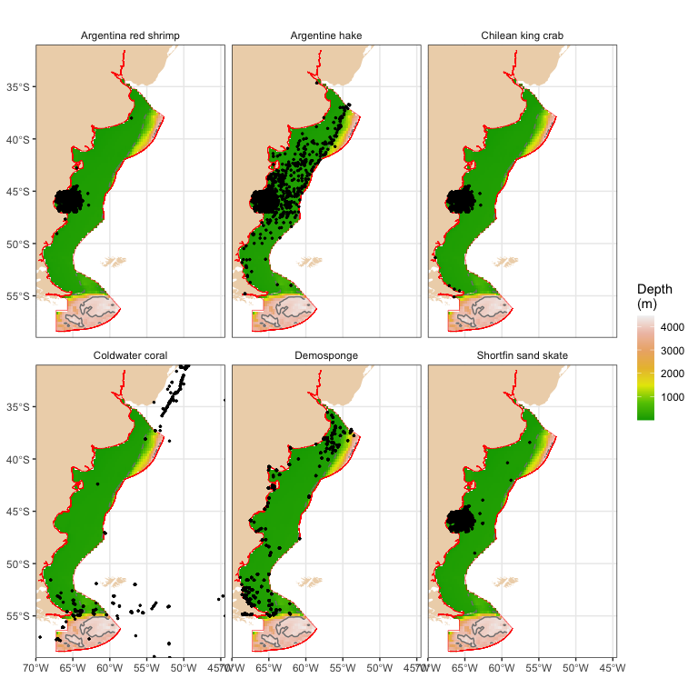
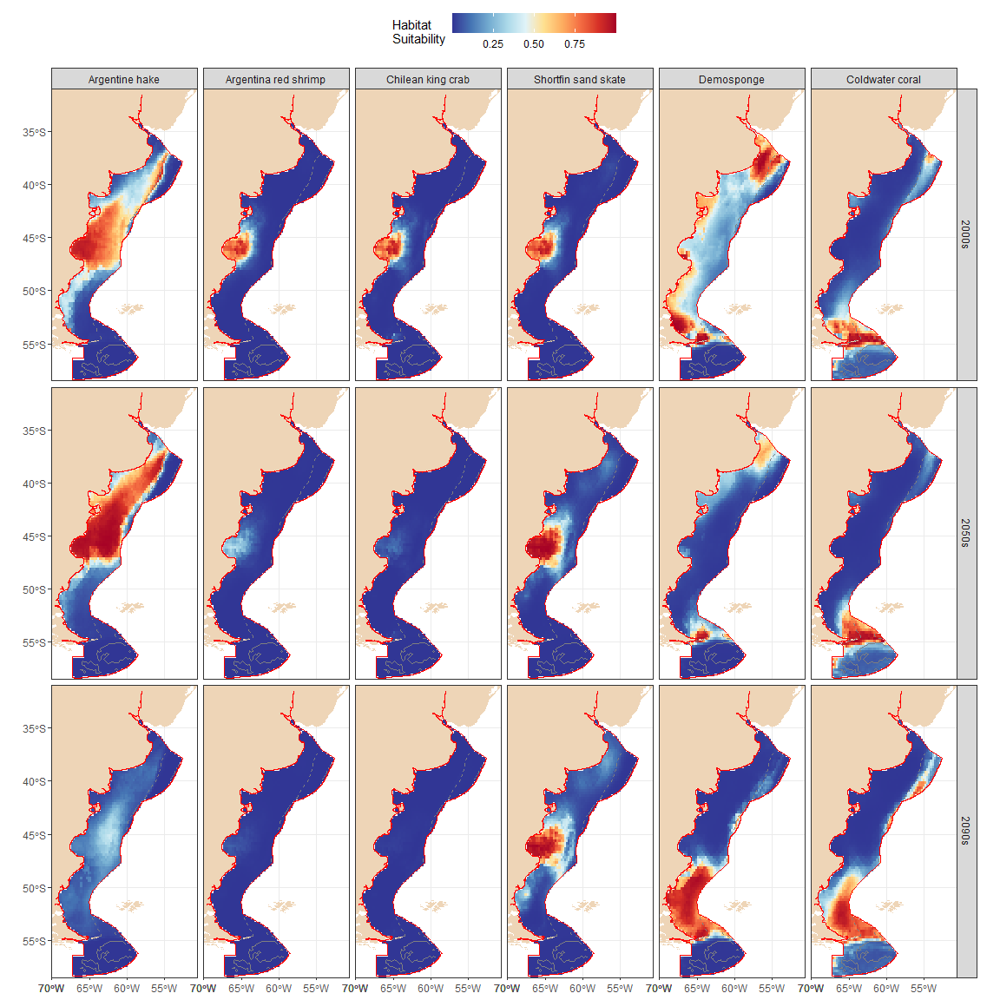

Applying seafloor climate change data for habitat suitability modeling
================
Chih-Lin Wei
2024-07-30

``` r
library(ArgentinaSSP585)
library(ggplot2)
library(dplyr)
library(tidyr)
library(RColorBrewer)
library(sf)
```

# Species occurrence data

We downloaded Argentine hake, Argentina red shrimp, Chilean king crab,
Shortfin sand skate, and Demospongiae occurrence data from
[OBIS](https://obis.org/area/7) using the
[occurrence](https://www.rdocumentation.org/packages/robis/versions/2.11.3/topics/occurrence)
function from the
[robis](https://www.rdocumentation.org/packages/robis/versions/2.11.3)
package. You may choose any other species from
[OBIS](https://obis.org/area/7) and no. 7 is the area ID for Argentina.
Additionally, the occurrence of cold water corals were downloaded from
[UNEP-WCMC](https://data.unep-wcmc.org/datasets/3).

``` r
library(robis)

# Download OBIS data
sponge <- occurrence(scientificname = "Demospongiae", areaid = 7)
hake <- occurrence(scientificname = "Merluccius hubbsi", areaid = 7)
shrimp <- occurrence(scientificname = "Pleoticus muelleri", areaid = 7)
crab <- occurrence(scientificname = "Lithodes santolla", areaid = 7)
skate <- occurrence(scientificname = "Psammobatis normani", areaid = 7)
cwc <- as.data.frame(coral)[,c("y", "x", "SPECIES")]
names(cwc) <- c("decimalLatitude", "decimalLongitude", "scientificName")

# Combine all occurrence data
occ <- rbind(hake[, c(6:7, 21)] %>% cbind(Taxa="Argentine hake"), 
             shrimp[, c(6:7, 21)] %>% cbind(Taxa="Argentina red shrimp"), 
             crab[, c(6:7, 21)] %>% cbind(Taxa="Chilean king crab"), 
             skate[, c(6:7, 21)] %>% cbind(Taxa="Shortfin sand skate"), 
             sponge[, c(2:3, 6)] %>% cbind(Taxa="Demosponge"), 
             cwc %>% cbind(Taxa="Coldwater coral")
             )
```

Here, let’s look at the first five records of the Argentine hake data.

``` r
library(knitr)

head(hake[, c(6:7, 21)], 5) %>% kable
```

| decimalLatitude | decimalLongitude | scientificName    |
|----------------:|-----------------:|:------------------|
|       -45.63333 |        -66.11667 | Merluccius hubbsi |
|       -45.65000 |        -66.35000 | Merluccius hubbsi |
|       -45.30000 |        -65.68333 | Merluccius hubbsi |
|       -45.09917 |        -65.74970 | Merluccius hubbsi |
|       -45.30000 |        -65.53333 | Merluccius hubbsi |

There are a total of 48181 occurrence records within the [Argentina
EEZ](https://marineregions.org/gazetteer.php?p=details&id=8466). We can
then overlay them on top of the
[etopo2022](https://www.ncei.noaa.gov/products/etopo-global-relief-model)
raster to see the data distribution.

``` r
bathy <- etopo2022 %>% mask(eez) %>% as.data.frame(xy = TRUE) %>% na.omit

ggplot(bathy) +
  geom_raster(aes(x=x, y=y, fill=-layer))+
  geom_polygon(data=arg, aes(x=X, y=Y, group=PID), fill="bisque2", colour="transparent")+
  geom_sf(data=as(eez, "sf"), fill="transparent", colour="red")+
  geom_contour(data=bathy, aes(x=x, y=y, z=layer), breaks=-200, linetype=2, colour="gray50")+
  geom_contour(data=bathy, aes(x=x, y=y, z=layer), breaks=-4000, linetype=1, colour="gray50")+
  geom_point(data=occ, aes(x=decimalLongitude, y=decimalLatitude), size=0.5)+
  facet_wrap(~Taxa)+
  scale_fill_gradientn(colours=terrain.colors(7))+
  scale_x_continuous(expand = expansion(mult = 0))+
  scale_y_continuous(expand = expansion(mult = 0))+
  labs(x=NULL, y=NULL, fill="Depth\n(m)")+
  theme_bw() %+replace% theme(legend.position = "right", legend.key.width =  unit(0.5, 'cm'),
                              strip.background = element_blank())
```

<!-- -->

# Environmental predictors

Besides extracting data for each coordinate, we can also apply these
data for simple habitat suitability modeling using
[Maxent](https://www.rdocumentation.org/packages/dismo/versions/1.3-14/topics/maxent)
from the
[dismo](https://www.rdocumentation.org/packages/dismo/versions/1.3-14)
package. Here, we’d like to model the species occurrence using the
historical projection from 1950 to 2000 and then the
[Maxent](https://www.rdocumentation.org/packages/dismo/versions/1.3-14/topics/maxent)
model to predict their habitat suitability in 2041 to 2060 and 2081 to
2100. Therefore, we need three sets of annual average of the climate
change projections for 1950 to 2000, 2041 to 2060, and 2081 to 2100.
Because water depth is usually the most critical factor controlling the
species distribution in the deep sea, we also add the
[etopo2022](https://www.ncei.noaa.gov/products/etopo-global-relief-model)
global relief model into the predictors. The predictor names are
modified (e.g., removing the years) to be consistent across 1950 to
2000, 2041 to 2060, and 2081 to 2100 for the convenience of modeling and
predictions.

``` r
hist <- addLayer(etopo2022, cmip6_1950_2000_av)
names(hist)[-1] <- gsub("_av_1950_to_2000", "", names(cmip6_1950_2000_av))

proj1 <- addLayer(etopo2022, cmip6_2041_2060_av)
names(proj1)[-1] <- gsub("_av_2041_2060", "", names(cmip6_2041_2060_av))

proj2 <- addLayer(etopo2022, cmip6_2081_2100_av)
names(proj2)[-1] <- gsub("_av_2081_2100", "", names(cmip6_2081_2100_av))
```

# Species distribution modeling

The commands in
[Maxent](https://www.rdocumentation.org/packages/dismo/versions/1.3-14/topics/maxent)
are pretty simple. We only need a raster brick of predictors and
coordinates of species occurrence to create a model. The historical and
future species’ habitat suitability can be
[predicted](https://www.rdocumentation.org/packages/dismo/versions/1.3-14/topics/predict)
using seafloor climate change data and the Maxent model. As a
demonstration, we will skip all other details, such as the model
validation, performance or variable importance, etc. More details on
applying Maxent and other species distribution modeling methods can be
found in [Hijmans and Elith
(2023)](https://rspatial.org/raster/sdm/raster_SDM.pdf).

``` r
library(dismo)
library(doBy)

# Split the occurrence datq by taxa into a list consisting of six sets of occurrence coordinates
# Conduct Mexent modeling on each set independently
r <- lapply(splitBy(~Taxa, occ), FUN = function(x){
  # Covert the coordinates to spatial point dataframe
  coordinates(x) <- c("decimalLongitude", "decimalLatitude")
  # Maxnet modeling
  me <-maxent(hist, x)
  # Predict habitat suitability
  out <- addLayer(predict(me, hist), predict(me, proj1), predict(me, proj2))
  names(out) <- c("Y1950_2000", "Y2041_2060", "Y2081_2100")
  return(out)
})
```

We can use the
[extract](https://www.rdocumentation.org/packages/raster/versions/3.6-23/topics/extract)
function to take a quick look at the historical predictors used in the
model. This predictor table is corresponded to the previous Argentine
hake table.

``` r
raster::extract(hist, occ[,c("decimalLongitude", "decimalLatitude")]) %>% head(5) %>% kable(digits=3)
```

|   layer |    epc |    o2 |    ph | thetao | arag | calc |   co3 | co3satarag | co3satcalc | aragsat | calcsat |
|--------:|-------:|------:|------:|-------:|-----:|-----:|------:|-----------:|-----------:|--------:|--------:|
| -94.252 | 78.079 | 0.269 | 8.068 |  7.812 |    0 |    0 | 0.133 |      0.069 |      0.043 |   2.280 |   3.088 |
| -93.348 | 80.378 | 0.269 | 8.068 |  7.784 |    0 |    0 | 0.132 |      0.069 |      0.043 |   2.270 |   3.085 |
| -96.112 | 81.301 | 0.271 | 8.070 |  7.898 |    0 |    0 | 0.133 |      0.069 |      0.043 |   2.271 |   3.107 |
| -60.670 | 77.979 | 0.271 | 8.071 |  7.987 |    0 |    0 | 0.134 |      0.069 |      0.043 |   2.278 |   3.126 |
| -96.112 | 81.301 | 0.271 | 8.070 |  7.898 |    0 |    0 | 0.133 |      0.069 |      0.043 |   2.271 |   3.107 |

# Habitat suitability projections

Finally, we map the projected habitat suitability of Argentine hake,
Argentina red shrimp, Chilean king crab, Shortfin sand skate,
Demosponge, and Coldwater coral for the years 1951 to 2000 (2000s), 2041
to 2060 (2050s), and 2081 to 2100 (2090s), respectively.

``` r
library(plyr)

# For each prediction raster brick, mask the raster layer by Argentina EEZ, convert the prediction raster into data frame, and then stack the data frame for ggplot
dat <- lapply(r, FUN=function(x){
  x %>% mask(eez) %>% as.data.frame(xy = TRUE) %>% na.omit %>% gather(-x, -y, key = "var", value = "value")
}) %>% ldply(.id="Taxa")
dat$var <- factor(dat$var, labels=c("2000s", "2050s", "2090s"))

ggplot(dat) +
  geom_raster(aes(x=x, y=y, fill=value))+
  geom_polygon(data=arg, aes(x=X, y=Y, group=PID), fill="bisque2", colour="transparent")+
  geom_sf(data=as(eez, "sf"), fill="transparent", colour="red")+
  geom_contour(data=bathy, aes(x=x, y=y, z=layer), breaks=-200, linetype=2, colour="gray50")+
  geom_contour(data=bathy, aes(x=x, y=y, z=layer), breaks=-4000, linetype=1, colour="gray50")+
  #geom_point(data=occ, aes(x=decimalLongitude, y=decimalLatitude), size=0.2)+
  facet_grid(var~Taxa)+
  scale_fill_gradientn(colours=brewer.pal(10, 'RdYlBu') %>% rev)+
  scale_x_continuous(expand = expansion(mult = 0))+
  scale_y_continuous(expand = expansion(mult = 0))+
  labs(x=NULL, y=NULL, fill="Habitat\nSuitability")+
  theme_bw() %+replace% theme(legend.position = "top", legend.key.width =  unit(1, 'cm'))
```

<!-- -->
